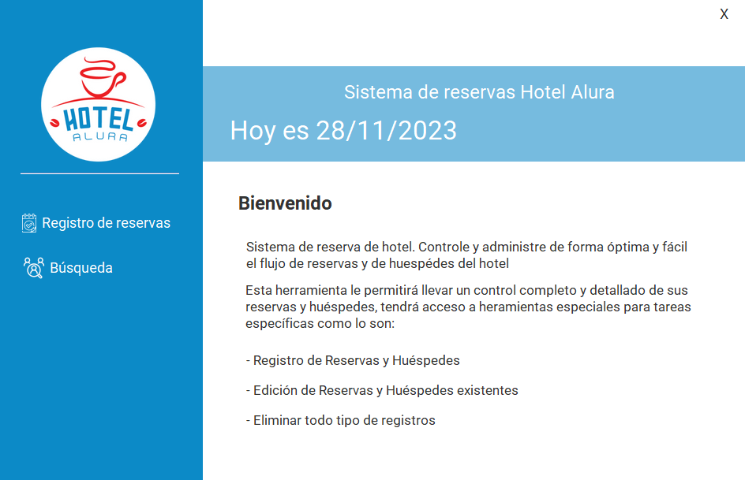

# Hotel Alura

# Índice

- [Descripción del proyecto](#Descripción-del-proyecto)
- [Estado del proyecto](#Estado-del-proyecto)
- [Acceso al proyecto](#Acceso-al-proyecto)
- [Tecnologías utilizadas](#Tecnologías-utilizadas)

# 📝 Descripción del proyecto

El presente proyecto es un aplicativo desarrollado con el fin de brindar un sistema de gestión de registros de huespedes y reservaciones.

En programa Hotel Alura posee las siguientes funcionalidades:

- Sistema de autenticación de usuario para que solo usuarios pertenecientes al hotel consigan acceder al sistema;

- Permitir crear, editar y eliminar una reserva para los clientes;

- Buscar en la base de datos todas la informacion tanto de los clientes como de las reservas;

- Registrar, editar y eliminar datos de los huéspedes;

- Calcular el valor de la reserva en base a la cantidades de días de la reserva y a una tasa diaria que puede ser asignada por ti y en la moneda local de tu país, por ejemplo si tenemos una reserva de 3 dias
  y el valor de nuestra diaria son 20$ debemos multiplicar esos 3 dias por el valor de la diaria, lo que serian 60$, todo esto deberá ser hecho automaticamente y mostrado al usuario antes de guardar la reserva

- Base de datos para almacenar todos los datos pedidos anteriormente.

# 🟢 Estado del proyecto

El proyecto por el momento se encuentra finalizado, no obstante se tiene pensado agregarle otro tipo de funcionalidades en el futuro, tales como otro el almacenamiento de mayor información.

# 🚧 Acceso al proyecto

## Opción 1
- Ejecutar archivo `script-db-hotel-alura.sql` para crear la base de datos `db-hotel-alura` en el servidor MySQL, descargalo haciendo clic [aquí](https://github.com/YinnerC30/challenge-hotel-alura/blob/main/assets/script-db-hotel-alura.sql)
- Clonar el repositorio desde la siguiente URL : `https://github.com/YinnerC30/challenge-hotel-alura.git`
- Importar proyecto en algun IDE (recomiendo IntelliJ)
- Ejecutar aplicación desde la clase y metodo `Main`
## Opción 2
- Ejecutar archivo `script-db-hotel-alura.sql` para crear la base de datos `db-hotel-alura` en el servidor MySQL, descargalo haciendo clic [aquí](https://github.com/YinnerC30/challenge-hotel-alura/blob/main/assets/script-db-hotel-alura.sql)
- Descargar el archivo `challenge-hotel-alura.jar` haciendo clic [aquí](https://github.com/YinnerC30/challenge-hotel-alura/blob/main/out/artifacts/challenge_hotel_alura/challenge-hotel-alura.jar).
- Abrir una terminal en el direcotiro donde se descargo el anterior archivo
- Ejecutar el comando `java -jar challenge-hotel-alura.jar.jar`

- Credenciales de acceso: usuario: admin | contraseña: 1234admin

Nota: Asegurate que la conexión a la base de datos MySQL de tu computadora (usuario, contraseña, puerto de escucha servidor) concuerden con los parametros de la cadena de conexión del presente proyecto.

# 👨‍💻 Tecnologías utilizadas

- Java 17
- Libreria Swing
- Base de datos MySQL
